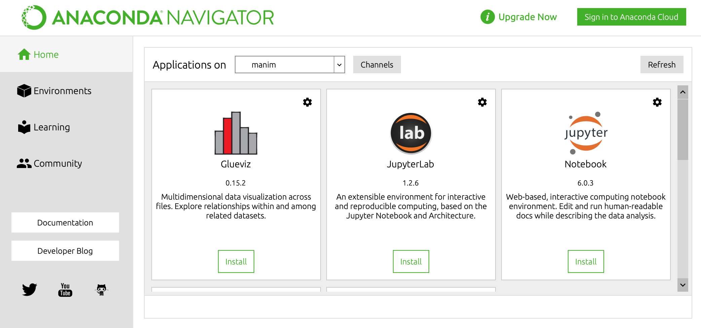

# Week 1: Welcome to Data Science!
<figure class="image">
  
  <!-- <figcaption>xkcd.com/2289</figcaption> -->
</figure>

## Workshop 
Today we'll be working with video data
- Open up [INSERT COLAB LINK](INSERT COLAB LINK) 
    1. Sign into a Google account
    2. Click `Open with Google Colaboratory`
    3. (In the notebook) Navigate to `File` > `Open in playground mode`
    4. (Once that loads) Hit `Copy to Drive` to save a copy to your Drive account 

## Lab
### Install Anaconda
Anaconda is a toolkit that (among many other things) does the hard work of installing, organizing, and securing all the data science software we'll be using this semester. 

- Head over to the [installation page](https://www.anaconda.com/products/individual)
    1. Scroll down to `Anaconda Installers`
    2. Select the **graphical installer** for your OS, *not the command line installer below*
    3. Follow through with the installation instructions
    4. If all goes well, you should be able to open up Anaconda like this:
    

