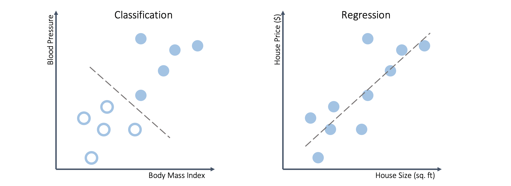

# Thinking Like A Machine

## Why bother?
You're on an evening jog, listening to bops on your ancient iPod. You like your music, but it's getting pretty old. The artists your friends suggest are hit or miss, and it's just hard to find good new songs out of your comfort zone.

Spotify revolutionized the game. They made finding new music incredibly personalized, based on entirely your tastes.


How? It's not magic, just data. Each time you play a song, some database off in Sweden makes a little note of it. Turns out, each listener sticks to their own little cluster of artists and sub-sub-genres, so they play it a lot. If the songs you play happen to fit in with some of those groups, it's pretty likely you'll enjoy the other songs they're listening to.  

Over time, that network can get pretty robust. With *hundreds of millions* of users each month, Spotify can pretty accurately predict what you'll like, and what you won't like. 

## What is AI?
Artificial intelligence is a set of techniques that pair *human intuition* with computational power. 

Take the following task: You're at a restuarant, and the server is reciting the toppings for today's specialty pizzas. You gauge your friend Charlie's reaction to each, and jot them down on a napkin.
```
Option 1: Sausage, Spinach, Feta, Alfredo         Result: Yum!
Option 2: Chicken, Cherry Tomato, Pesto           Result: Great!
Option 3: Chicken, Onion, BBQ Sauce               Result: Awesome!
Option 4: Bell Pepper, Mushrooms, Olives (Vegan)  Result: Nope                    
Option 5: Mozarella, Basil, Tomato (Vegetarian)   Result: Yuck
```
There's one last item the server is about to read, but at this point you're pretty sure what Charlie's will think of it:
<br> `Option 6: Meat Lover's Delight. Sausage, Ground Beef, Bacon, and Ham`.
And that's what he ordered. 

No surprise, right? But how'd you know? Most likely, you first picked out a pattern...
```diff
+Option 1: Meat         Result: Yum!
+Option 2: Meat         Result: Great!
+Option 3: Meat         Result: Awesome!
-Option 4: No meat      Result: Nope                    
-Option 5: No meat      Result: Yuck
```
In your mind, you then generated a rule that describes most of the data. It was probably something like "Charlie likes meat", or more programmatically:
```python
if meat == True:
    return 'Good'
else:
    return 'False'
```
Finally, when given the items in Option 6, you used applied that rule to the novel data. Since there was meat, Charlie liked it.
______
Super straightfoward so far, but what if Charlie were to instead react with disgust at the meat lover's delight?
```diff
+Option 1: Sausage, Spinach, Feta, Alfredo         Result: Yum!
+Option 2: Chicken, Cherry Tomato, Pesto           Result: Great!
+Option 3: Chicken, Onion, BBQ Sauce               Result: Awesome!
-Option 4: Bell Pepper, Mushrooms, Olives (Vegan)  Result: Nope                    
-Option 5: Mozarella, Basil, Tomato (Vegetarian)   Result: Yuck
-Option 6: Sausage, Ground Beef, Bacon, and Ham    Result: Meh
```
That was unexpected. Our hypothesis, and in turn our rule, was proven wrong. Perhaps there was another pattern that better explained the data? Perhaps Charlie wasn't a fan of marinara sauce, or only enjoyed pizzas with exactly one type of meat. Both are valid hypothesis from what we've seen so far, but we'd need much more data to test it out.
______

**Machine learning** is a subset of AI techniques that *learns* by picking out patterns from data. 
They get better as they see more data, and can employ all sorts of nifty statistical or algorithmic strategies to find the pattern we tried to analyze ourselves.

There's a couple distinct areas within machine learning, each of which have their own use cases. For now, we'll try to cover the lingo, just to help us think about when we'd use what.
 
## Supervised Learning
When we try to model a situation, we see the inputs, or **X**, and the outputs, **y**. 
- If we're trying to generate y from x, we'll usually be given some rule: `y = 2x` (This is NOT machine learning). 
- Otherwise, we have to generate the rule: `y = mx + b`, by finding `m` and `b` (This IS machine learning).


With supervised learning, we're always given outcomes, or **labels** to train our model on. 
For example, we could have some medical data, and have labels on if the patient has a heart condition.
| BMI | Blood Pressure | Age | Heart Failure? |  
|:----|:---------------|:----|:---------------|
|26|143/97 |68|Y|
|29|154/103|54|Y|
|21|110/74 |62|N|
|24|123/83 |45|N|
|28|165/112|57|Y|

After training our model using some algorithm, we can predict outcomes on *new data*.

| BMI | Blood Pressure | Age | Pred. Heart Failure? |  
|:----|:---------------|:----|:---------------|
|26|134/84|62|**Y**|
|22|117/76|56|**N**|

### Classification vs. Regression 
Quick note: With our pizza example, the outcome we needed to predict was binary, a yes or no response. That means our task use information about the ingredients to *classify* whether the given toppings would be accepted or rejected.

On the other hand, we might want to predict a continuous variable, like the price of a house. It could cost $300k, $400k or $400.1k. We call this type of problem a *regression*. This distinction is really important; it determines how we evaluate our model's performance, as well as which algorithms we can use to predict the outcome.



## Unsupervised Learning
However, we may not always have a priori labels. We still want to see patterns in the data, and see if there are any insights to be picked up.
Take our spotify data from before:
| Customer # | Top 5 Artists|  
|:----|:---------------------------------|
|1|Kendrick Lamar, Post Malone, Kanye West, Jay-Z, A$AP Rocky |
|2|Childish Gambino, Chance the Rapper, Kendrick Lamar, Frank Ocean, Mac Miller|
|3|Quinn XCII, Jeremy Zucker, AJR, Alec Benjamin|
|4|Lauv, Quinn XCII, Dean Lewis, Alec Benjamin, Joel Adams|

There's isn't necessarily a strict label for each artist. From a first glance, lines 1 & 2 seem to have only hip-hop and rap artists, while 3 & 4 fall along pop or electropop artists. 

But what about artists like Post Malone, who regularly gets listens from users who otherwise usually just listen to pop radio stations?

The point is, we don't need to do all the hard work of manually defining "groups" ourselves. We can show user's listening patterns, and cluster artists based on common users. In doing so, we sort out a relatively random jumble of artists into distinct categories.


## Summary
- **Supervised** learning involves predicting outcomes when *given* labels, while **unsupervised** learning finds patterns without any labels
- Two common tasks in supervised learning are **classification** and **regression**. We use classification techniques when we want to predict what *group* the observation is a part of, and regression we want to predict some *value*.