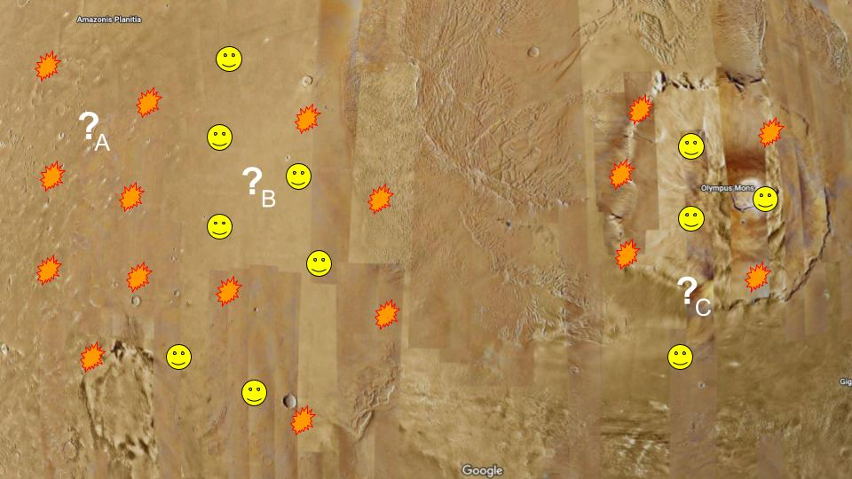

# Landing on Mars
You have been given the important responsibility of deciding where to land our next rover on Mars! Martian land is either considered "safe" or "unsafe." Our satallite imaging of Mars is not clear enough to determine the safeness of land. However, we can look at our previous missions to predict the safeness of certain areas. Successful landings are represented with a smiley face, and unsuccessful landings (attempts on unsafe areas) are marked with an explosion.

&nbsp;

## Previous mars landing attempts

Your team is considering <b>three potential target landing zones </b>, represented by '?' in the image below.

&nbsp;

## Potential landing zones ('?')

&nbsp;

## Your decision
Which zone do you believe is most likely to be safe?

How did you come to that conclusion?

&nbsp;

# Nearest Neighbors
Most likely you based your decision on the successes of the surrounding areas. All of the attempted landings closely surrounding spot 'A' were failures. All of the attempted landings closely surrounding spot 'B' were successes. Spot 'C' is more ambiguous because there are some successes and some failures around it.

&nbsp;

This is the exact thought process behind the K-Nearest Neighbors Classifier! The value of 'K' is the number of neighbors we consider. This value is selected by you, the data scientist. Different values of 'K' will be more effective for different datasets.

&nbsp;

## KNN is like a voting system
Think of each of the k nearest neighbors as casting a vote to make the prediction. For example, if we choose k=5, we consider the five closest points to our potential landing zone. If three of them are safe and two are unsafe, we predict that our potential landing zone is safe.

<i>It is good practice to choose an odd number for k so that there are no ties.</i>

&nbsp;

## Review
Is the Mars problem an example of a classification problem or a regression problem?

&nbsp;

## Applying KNN Outside Of Geography

"Nearest neighbors" doesn't necessarily mean geographically. We can plot data and use the distance between points on the graph.

&nbsp;

# CODING TIME!!!

&nbsp;

# Landing on Mars 2.0
Congratulations! Your boss was so impressed with your successful evaluation of the first landing zone that he has tasked you again with determining a landing zone for a new mission.

This time, you are targeting a specific elevation. Advanced research suggests that we are most likely to find evidence of alien life at an elevation of 10,000m. Satellite measurements are spotty, but you know the elevation of a few places on the surface of Mars.

