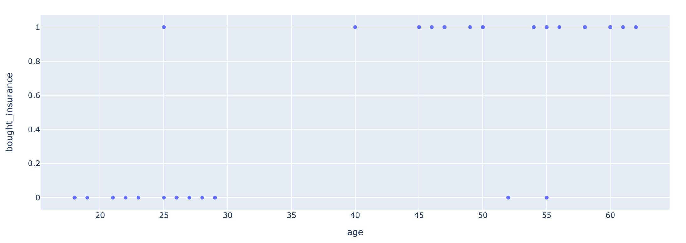
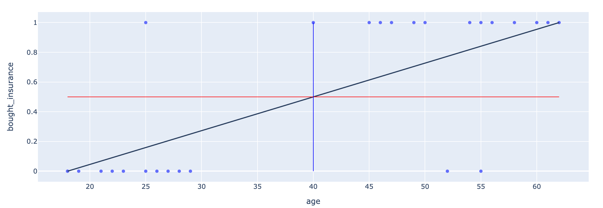
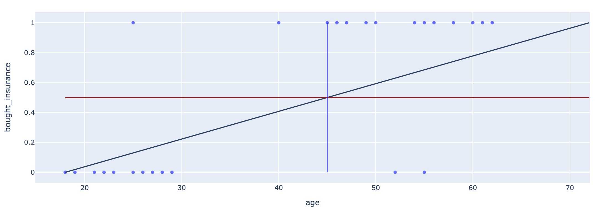
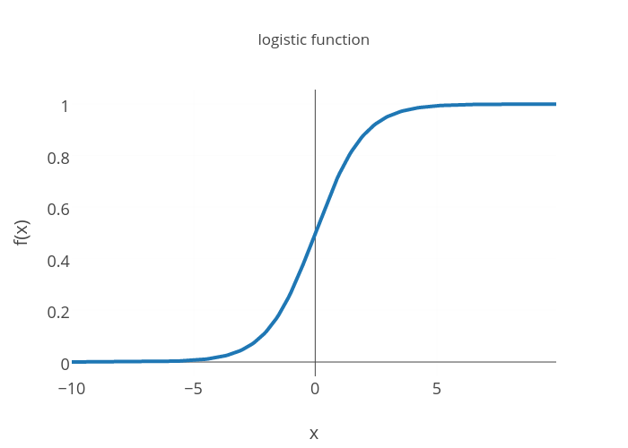

# Logistic Regression

Although "regression" is in the title, it is commonly used for classification models. Let me explain...

## Age vs. Insurance
Let's look at a quick dataset that has the age of people and whether or not they have insurance.

| Age | Has Insurance? |
| 22 | 0 |
| 25 | 0 | 
| 47 | 1 | 
| 52 | 0 | 
| 46 | 1 | 
| 56 | 1 | 
| 55 | 0 | 
| 60 | 1 | 
| 62 | 1 | 
| 61 | 1 | 
| 18 | 0 | 
| 28 | 0 | 
| 27 | 0 | 
| 29 | 0 | 
| 49 | 1 | 
| 55 | 1 | 
| 25 | 1 | 
| 58 | 1 | 
| 19 | 0 | 
| 18 | 0 | 
| 21 | 0 | 
| 26 | 0 | 
| 40 | 1 | 
| 45 | 1 | 
| 50 | 1 | 
| 54 | 1 | 
| 23 | 0 | 

## Graph of Age vs. Insurance

You can see that as people get older, they are more likely to get insurance. Let's see if we can draw a linear trend here.

This doesn't look too bad! Let's try to add another point though.

You can see that linear regression can only go so far with classification models, which is why we don't use it. This is where logistic regression comes into play.

## What is a Logistic Curve?

$$ y = \frac{1}{1 + be^{kx}} $$

Above is an example of a logistic curve along with the equation for it. You may notice that it has upper and lower bounds, which makes it useful for classification.

## Applying It

**Place Image of Age vs. Insurance here with the logistic curve**

## Coding Time!

#### Notes
 | Quick Open | Interactive Notebook | Source Code  |
 | :--------: | :-----------: | :------------: |
 |  |  |  |

#### Key
 | Quick Open | Interactive Notebook | Source Code  |
 | :--------: |:-----------: | :------------: |
 |  |  |  |