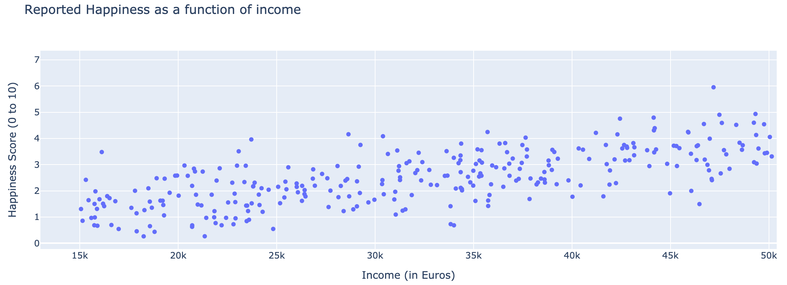
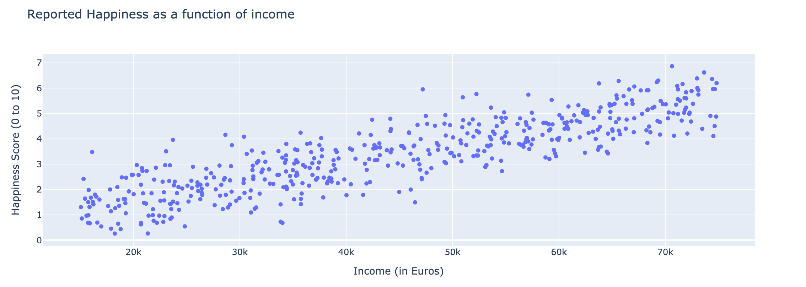
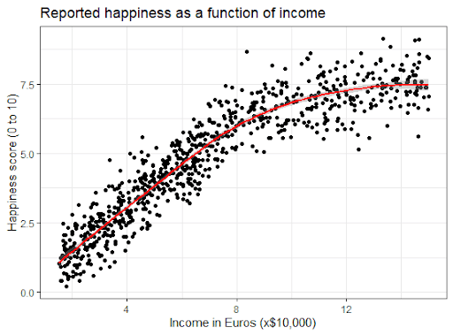

# Linear Regression

So far, we have only looked as *classification* models for machine learning. Let's take a dive into **regression** models, starting with Linear Regression.

# Mo' Money, Less Problems?

Does money equal happiness? Many people have asked this question and you have been tasked with finding the answer using data science. You collected a bunch of survey data measuring the happiness levels of people with varying levels of income, hoping to see if there is any correlation. Questions whether money DOES equal happiness, you decide to graph it:

## Income vs. Happiness Data

Unfortunately, you were only able to get those with an income up to $50k. So, let's try to predict how happy people with a higher income will be.
Based on this, what do you think the happiness score of someone around $70k income look like?

## More Surveying

There you have it. Looks like your prediction was correct! It seems to follow a **linear** pattern/correlation, which is the basis of linear regression. Let's keep looking at more data to see if the trend follows

## Even More Surveying

It looks like the trend seems to level out at a certain point (at about $75k), showing that it isn't always going to be a linear correlation between money and happiness. Be careful to not overextend your predictions with linear regression because it may not *always* follow a linear trend.

With that, let's hop into some coding!

# Coding Time!
Linear Regression deals with *linear* trends in the (hopefully familiar) form of:

$$ y = \beta_{1} x + \beta_{0} $$

The coefficients above are known as *beta coefficients*. With this knowledge, let's move onto an example.

#### Notes
 | Quick Open | Interactive Notebook | Source Code  |
 | :--------: | :-----------: | :------------: |
 |  |  |  |

#### Key
 | Quick Open | Interactive Notebook | Source Code  |
 | :--------: |:-----------: | :------------: |
 |  |  |  |